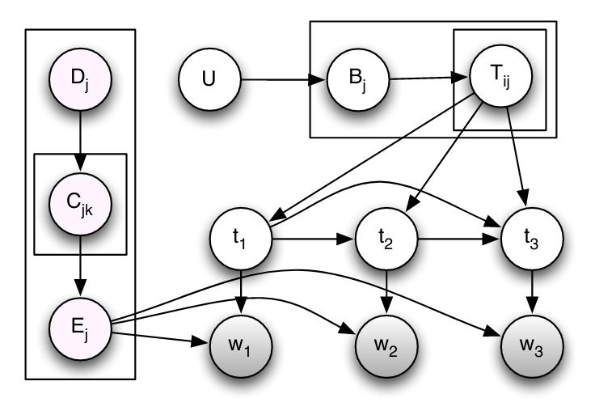

**Polya** is a Python/C++ library for performing inference with [Pólya urn models](https://en.wikipedia.org/wiki/Polya_urn_model) (including [Chinese restaurant processes](https://en.wikipedia.org/wiki/Chinese_restaurant_process)) with an emphasis on (hierarchical) [Pitman-Yor processes](https://en.wikipedia.org/wiki/Pitman-Yor_process), although [Dirichlet processes](https://en.wikipedia.org/wiki/Dirichlet_process) and [Dirichlet-multinomial](https://en.wikipedia.org/wiki/Dirichlet-multinomial_distribution) (and [Beta-binomial](https://en.wikipedia.org/wiki/Beta-binomial_distribution)) models could be handled as special cases with minor modifications. Nonparametric mixture modelling is also partially supported (only when the number of components is bounded, for now).

Example implementations of the [hierarchical Pitman-Yor language model (HPYLM)](http://dx.doi.org/10.3115/1220175.1220299), the [doubly-HPYLM (DHPYLM)](http://jmlr.org/proceedings/papers/v5/wood09a.html), and the [PYP-HMM](http://aclweb.org/anthology/P11-1087) are also provided:

    $ cd data && python brown.py && python sou.py && cd ..
    $ ./hpylm.py < data/brown.reduc.txt > hpylm.log
    Perplexity: 231.818141085
    $ cat data/{sou.norm.train,brown.norm,sou.norm.test}.txt | \
        ./hpylm.py 3 `wc -w < data/sou.norm.test.txt` > union.log
    Perplexity: 169.793801556
    $ ./dhpylm.py 3 data/{sou.norm.test,sou.norm.train,brown.norm}.txt > dhpylm.log
    Perplexity: 159.532152794
    $ ./pyphmm.py < data/brown.tagged.simp.txt > pyphmm.log
    M-1: 81.1001970389
